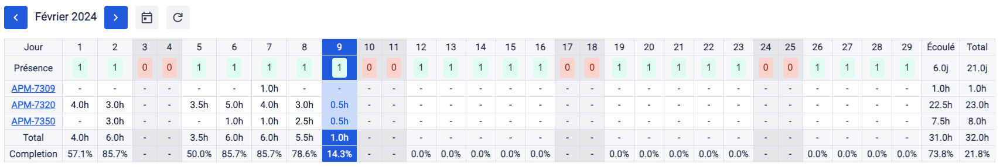

# JiraTimesheet

### Generate your Jira month timesheet.

## Installation

### Install on Safari

- Download the `SafariJiraTimesheetExtension.zip` from the latest release
- Extract and move the extracted folder where you want to store the extension, for exemple **Documents**
- Open your browser
- Go to the **Settings** > **Advanced** 
- Select the **Show features for web developers** check box
- Go to the **Developer** > **Developer Settings** 
- Select the **Allow unsigned extensions** check box
- Open the extrated folder and **CONTROL + Right Click** > **Open** on the `JiraTimesheetExtension.app`
- Go to the extension page of your browser and enable the extension
- The extension should be added to your browser

### Install on Firefox

- Download the `FirefoxJiraTimesheetExtension.zip` from the latest release
- Extract and move the extracted folder where you want to store the extension, for exemple **Documents**
- Open your browser
- Go to the extension page
- Click the **extension settings** button
- Click the **Debug Add-ons** button
- Select the **manifest.json** file in the extracted folder
- The extension should be added to your browser

### Install on Chromium

- Download the `ChromeJiraTimesheetExtension.zip` from the latest release.
- Extract and move the extracted folder where you want to store the extension, for exemple **Documents**
- Open your browser
- Go to the extension page
- Select the **Developer mode** check box
- Click the **Load unpacked** extension button
- Select the extracted folder
- The extension should be added to your browser

## Setup

To setup the extension you will need :

- Your Jira base URL
- Your Jira account email address (Used with API token to sign requests and to identify your worklogs)
- Your Jira account API token (Optionnal but recommended, can work without if the browser owns the Jira Auth Cookie)

To create an API token go to the **Atlassian Account Management** > **Security** > **API tokens**
